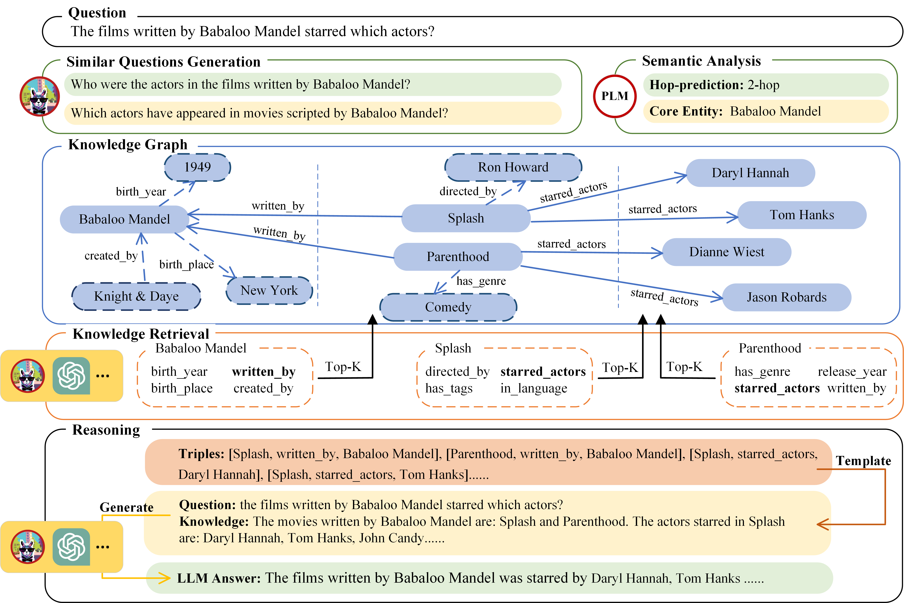

# KnowledgeNavigator
This is the code for our paper [KnowledgeNavigator: Leveraging Large Language Models for Enhanced Reasoning over Knowledge Graph]

## Structure

## Instructions

### Project Structure
* `bert_classify/`: Scripts for training hop predictor. See chapter bert training for details.
* `data/`: Processed datasets, inclufing MetaQA hop-2, hop-3 and WebQSP.
* `LLM/`: Scripts for locally running LLM services.
* `utils/`: Scripts for setting up knowledge graph.
* `KnowledgeNavigator/`
    * `config.py`: All configs for KnowledgeNavigator.
    * `generate_bert_prediction.py`: Predict the hop number of queries in dataset.
    * `generate_similar_question.py`: Generate similar questions with LLM for queries in dataset.
    * `main.py`: The main file of KnowledgeNavigator to set up knowledge retrieval and  question answering.
    * `model.py`: Interfaces for accessing different LLMs.
    * `prompt.py`: Prompts with 0/2 fewshots (in format suitable for LLama-2).
    * `triple_retrieve.py`: Core algorithms for retrieving knowledge.
    * `utils.py`: Format encoders, decoders, etc.

### Datasets

We provide processed datasets in `data/`, each set has 3 file: `query.txt`, `gold_answer.txt`, `predict_hop.txt`.

#### MetaQA

You can find MetaQA from [here](https://github.com/yuyuz/MetaQA) and download the datasets and knowledge graph from the [google drive](https://drive.google.com/drive/folders/0B-36Uca2AvwhTWVFSUZqRXVtbUE?resourcekey=0-kdv6ho5KcpEXdI2aUdLn_g). You can set up neo4j graph with the `kb.txt` in the google drive and `utils/init-metaqa-neo4j.py` in our project.

#### WebQSP

You can find WebQSP from [here](https://www.microsoft.com/en-us/research/publication/the-value-of-semantic-parse-labeling-for-knowledge-base-question-answering-2/) and Freebase data dump from [here](https://developers.google.com/freebase?hl=zh-cn). You can set up the Freebase for experiment following this [guide](https://github.com/sameersingh/nlp_serde/wiki/Virtuoso-Freebase-Setup).

### Get Started
* Train bert and predict the hop number of the questions in dataset with `generate_bert_prediction.py` (We provide the checkpoint for hop predicting on MetaQA dataset [here](https://drive.google.com/drive/folders/1hWU4vL7oExkm-vNEJCW95z_XO8rXhWP6?usp=drive_link), and the prediction result for each dataset in `data/{task}/predict-hop.txt`)
* Make sure you have successfully set up Freebase with virtuoso and the knowledge graphs for the other datasets with neo4j. Make sure you have successfully set up LLM and bert services, and set the url in `config.py`.
* Preprocess the dataset and place it in `data/{task}/`
* Generate similar questions for each question in dataset with LLM with         `generate_similar_question.py`. (We provide 2 similar questions for each question in MetaQA and WebQSP in `data/{task}/similar.txt`)
* Set `config.py` (including your knowledge graph url, LLM url, etc.)
* Run `main.py`

### Bert Training
* Create folder `KnowledgeNavigator/bert_classify/data/{task_name}` and split the dataset into train, test, dev. 
* Create `query.txt` with one question per line and `label.txt` with label of the questions in each folder.
* Create `intent_label.txt` that summarises all the labels, one per line.
* Add your new task in data_reader/processors.
* Run `main.py` 